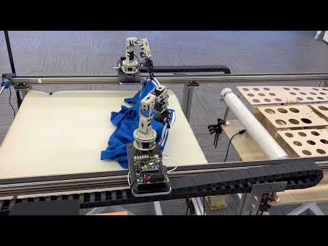

<h1 align="center">Hi 👋, I'm Weijie Liang
  

     
     
     
    
    
    
    
    
     
     
     
     
     
     
     
  

</h1>

<h3> 👨🏻‍💻 &nbsp;About Me </h3>

  - 🤔 &nbsp; Researching artificial intelligence, focusing on multimodality.
  - 🎓 &nbsp; Currently pursuing the double bachelor's degree in Electronic and Computer Engineering at Zhejiang University and University of Illinois Urbana-hampaign.
  - 🌱 &nbsp; Learning more about Cloud Architecture, Systems Design and Network traffic measurement.
  - 😄 &nbsp; Enjoys developing my indepedent game and watching cartoons in leisure time.

<h3> 🤝🏻 &nbsp;Connect with Me</h3>

  
    
&nbsp;&nbsp;&nbsp;&nbsp;&nbsp;&nbsp;  
      
    

    
&nbsp;&nbsp;&nbsp;&nbsp;&nbsp;&nbsp;  
      
    

    
&nbsp;&nbsp;&nbsp;&nbsp;&nbsp;&nbsp; 
      
    

    
&nbsp;&nbsp;&nbsp;&nbsp;&nbsp;&nbsp; 
      
    

  

<h3> ⚡ &nbsp;My Projects</h3>
<h4>Project 1: Multimodal Applications in Ultrasound Imaging Diagnosis</h4>
  

    Proposed a novel model named MSMedCap based on the BLIP2, a classical multimodality model. We added a parallel Segment Anything Encoder at the vision encoder side to capture fine-grained information from medical images and generate more precise diagnoses. The paper is published on ICASSP 2024, co-first authorship. Link to the paper is attached: <a href="https://ieeexplore.ieee.org/document/10446878">SAM-GUIDED ENHANCED FINE-GRAINED ENCODING WITH MIXED SEMANTIC LEARNING FOR MEDICAL IMAGE CAPTIONING</a>.
  

  

    <a href="https://github.com/AHandsomePython/MSMedCap">MSMedCap GitHub Repository</a>
  

  <h4>Project 2: Operating System Kernel Design</h4>
  

    Coursework of UIUC’s ECE391(Computer Architecture). We designed an operating system with functions including Scheduling, Dynamic Memory Allocation, Graphical User Interface, Signals, Dynamic File System, Mouse Driver, Sound Card Driver, and so on. The project gained the champion in the final competition of the course.
  

  

    <a href="https://github.com/AHandsomePython/ece391">ECE391 GitHub Repository</a>
  

  <h4>Project 3: Smart Laundry Foldbot </h4>
  

   Coursework of ZJU’s ECE445 (Senior Design). We designed a clothing folding machine, which is able to detect clothes, grab clothes and fold clothes. We use Mask-RCNN as our computer vision model to detect clothes and build our own training dataset. We also design an open-loop system with inverse kinematics method to drive the robot arm to grab clothes. Finally, clothes will be folded by an automatic folding machine. The video below shows how the robot works. 
  

<!-- insert a video -->

<!--
**Decade-qiu/Decade-qiu** is a ✨ _special_ ✨ repository because its `README.md` (this file) appears on your GitHub profile.

Here are some ideas to get you started:

- 🔭 I’m currently working on ...
- 🌱 I’m currently learning ...
- 👯 I’m looking to collaborate on ...
- 🤔 I’m looking for help with ...
- 💬 Ask me about ...
- 📫 How to reach me: ...
- 😄 Pronouns: ...
- ⚡ Fun fact: ...
-->

